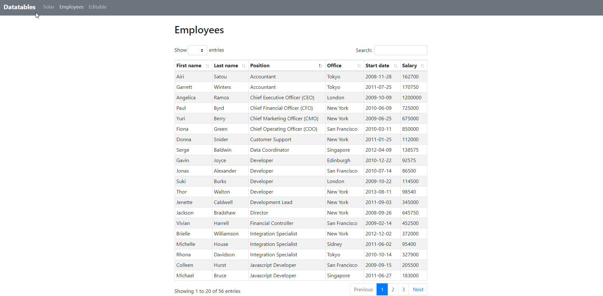

# Dash Datatables

Minimal [Dash](https://dash.plot.ly/) wrapper for the wonderful **[DataTables.net](https://datatables.net/)**


**Code Snippet**
```
from dash import html
import dash_datatables as ddt

import pandas as pd

df = pd.read_csv('https://raw.githubusercontent.com/plotly/datasets/master/solar.csv')

column_defs = [{"title": i, "data": i} for i in df.columns]

layout = html.Div([
    html.H2('US Solar Capacity'),
    html.Br(),
    ddt.DashDatatables(
        columns=column_defs,
        data=df.to_dict('records'),
        width="100%",
        order=[2, 'asc'],
    )
])
```
## Building component
 
To build the new Dash component source you must have python and node installed on 
your computer.

Create and activate a clean python environment, then:

```
    pip install -r requirements.txt
    pip install -r tests/requirements.txt

    npm install

    npm run build:dist
```
#### Create tarball

First change the release version in [package.json](package.json), then:

    python setup.py sdist bdist_wheel

The tarball is in *dist/dash_datatables-<version>.tar.gz*

If need, you can copy and install the tarball directly in a dash project:

    pip install dash_holoniq_components-<version>.tar.gz

#### Publish

To upload the package to pypi. See [Create a production build and publish]

    twine upload dist/*

### Usage Demo

To run the demo

        python usage.py

Then open [http://localhost:8050/solar](http://localhost:8050/solar)



## Debugging the javascript component source

A simple javascript demo `src\demo\index.js` is used to allow the `raw` javascript to
be debugged. To debug the component, breakpoints etc:

    npm run start

Then select `Debug JS Demo` from the lunch options and press `F5` to launch the 
Chrome debug configuration.

## Debugging the python demo `usage.py`

Then select `Debug usage.py` from the lunch options and press `F5` to launch the 
Flask/Dash development server.

Open [http://localhost:8050/solar](http://localhost:8050/solar)

Set breakpoints as required.

## Project

The project skeleton was created with the cookiecutter template:

        cookiecutter  https://github.com/plotly/dash-component-boilerplate.git


**Folder layout**

```
dash_datatables             : build results output folder (npm run build:all)
demo                        : Dash/Flash python demo (see usage.py)
src                         : React.js source for components(s) 
    demo                    : simple js demo
    lib                     
        components          : dash custom datatables source
    utils                   : js support code
tests                       : test code
usage.py                    : Dash/Flash python demo entry point
```

[Create a production build and publish]: https://github.com/plotly/


