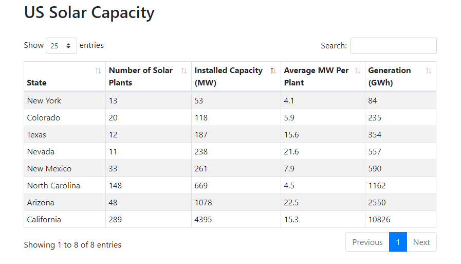

# dash-datatables

[Dash](https://dash.plot.ly/) wrapper for the wonderful **[DataTables.net](https://datatables.net/)**



**Code Snippet**
```
from dash import html
import dash_datatables as ddt

import pandas as pd

df = pd.read_csv('https://raw.githubusercontent.com/plotly/datasets/master/solar.csv')

column_defs = [{"title": i, "data": i} for i in df.columns]

layout = html.Div([
    html.H2('US Solar Capacity'),
    html.Br(),
    ddt.DashDatatables(
        columns=column_defs,
        data=df.to_dict('records'),
        width="100%",
        order=[2, 'asc'],
    )
])
```
## Installation

You can install *dash-datatables* with `pip`:

```
pip install dash-datatables
```

## Documentation

Head over to the [*README*][docs-homepage] for more details.

## Contributing

The source code for *dash-datatables* is available
[on GitHub][dash-datatables-repo]. If you find a bug or something is unclear, we encourage
you to raise an issue. We also welcome contributions, to contribute, fork the
repository and open a [pull request][dash-datatables-pulls].


[dash-homepage]: https://dash.plot.ly/
[dhc-repo]: https://github.com/stevej2608/dash-datatables
[docs-homepage]: https://github.com/stevej2608/dash-datatables/blob/master/README.md
[dhc-pulls]: https://github.com/stevej2608/dash-datatables/pulls
